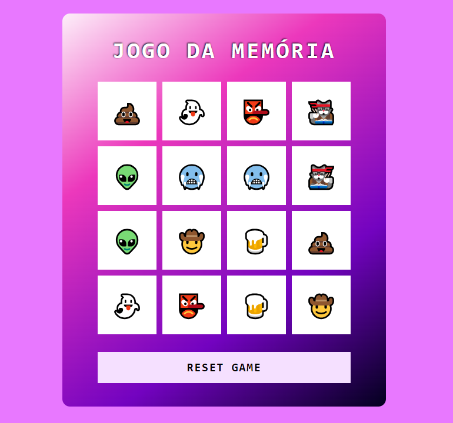

# Jogo da Memória com Emojis 👻

Bem vindo ao **Jogo da Memória com Emojis 👻**! Este jogo é uma versão com emojis do tradicional "jogo da memória" que já conhecemos. O objetivo é encontrar todos os pares de emojis correspondentes, virando duas cartas por vez. Este projeto foi desenvolvido com o intuito de praticar conceitos avançados de desenvolvimento de jogos em JavaScript, incluindo manipulação de DOM.

   

### ⚙ Tecnologias Utilizadas

- HTML5 e CSS3 para a estrutura e aparência do jogo.
- JavaScript para a lógica de programação e interatividade.

### ✔️ Funcionalidades 

- **Interface Intuitiva**: Uma interface simples e intuitiva para uma experiência de usuário amigável.
- **Desafio de Memória**: Teste suas habilidades de memória ao encontrar todos os pares corretos.
- **Game Reset**: Permite que o usuário reinicie o jogo a qualquer momento!
- **Jogue em qualquer tela**: Foi adicionada a **responsividade** ao jogo, o que significa que ele está apto para ser jogado em qualquer tipo de tela, seja PCs, Notebooks, Tablets, Smartphones, entre outros!

### 🕹️ Como Jogar ?

1. Clone este repositório para sua máquina local.
2. Abra o arquivo `index.html` em seu navegador web.
3. Divirta-se jogando!
5. Ou, [Clique aqui] (https://mari4souza.github.io/emoji-memory-game/).

### 🤝🏻 Contribuição

Contribuições são bem-vindas! Se você deseja melhorar este jogo, adicionar novos recursos ou corrigir problemas, sinta-se à vontade para abrir um _pull request_.

### 📝 Créditos

Este jogo foi desenvolvido como parte de um projeto educacional da Digital Innovation One.
